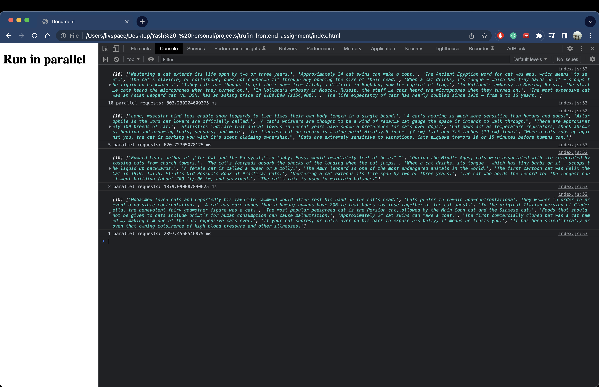
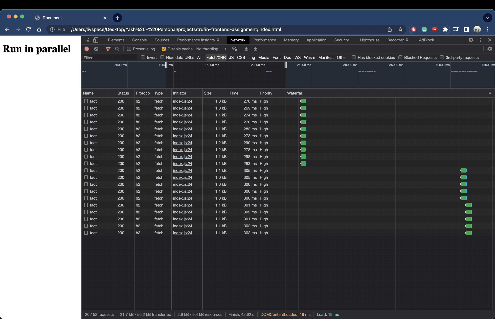
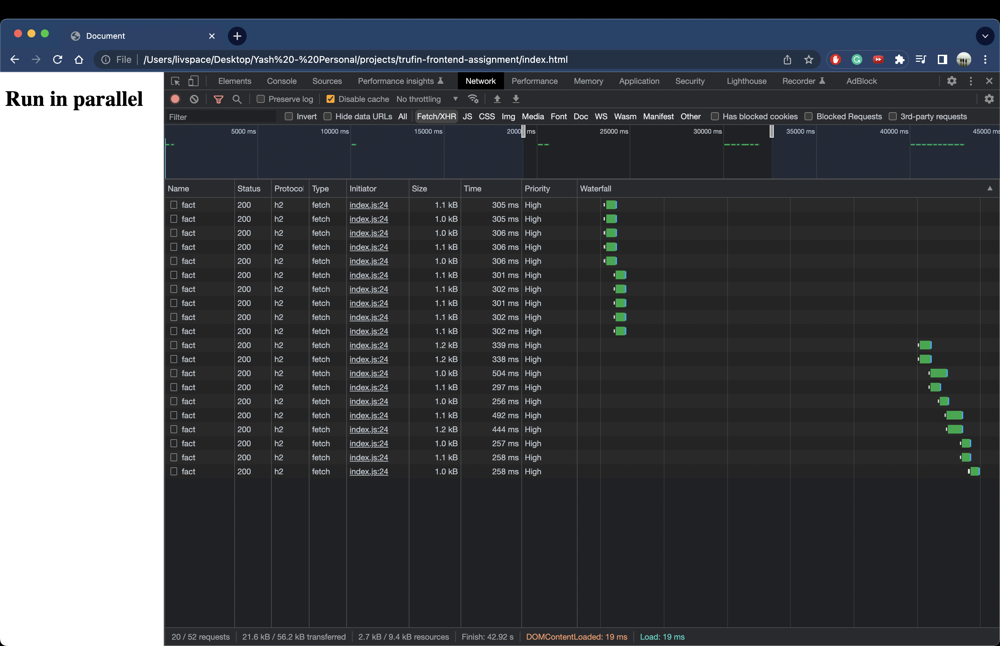
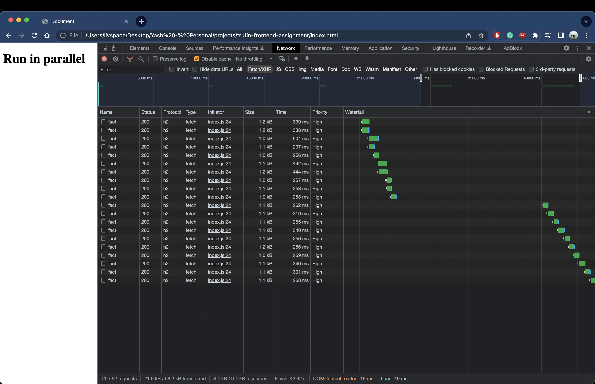

# Concurrent Network Requests with a limit in Javascript

Running asynchronous tasks with a concurrency limit can be useful when you don't want to overwhelm an API or want to keep resource usage below the maximum threshold. Some popular javascript libraries that allow to fetch multiple resources in parallel with a concurrency limit

- [p-limit](https://www.npmjs.com/package/p-limit)
- [async](https://caolan.github.io/async/v3/)
- [bottleneck](https://www.npmjs.com/package/bottleneck)

This repository contains a basic implementation for running multiple promise-returning & async functions with limited concurrency. 

Design a component (a `function` or a `class`) that accepts an array of URLs and allows to fetch multiple resources in parallel, returning their `.text` representation. Provide a parameter so that the caller can limit the number of concurrent fetches run in parallel. A minimal interface for such a component could be the following

The function `multiRequest` accepts an Array of URLs `urls` and a Number parameter `maxNum` to limit the number of concurrent fetches run in parallel. The function returns a Promise which resolves to return an Array of text representation of the URL responses.

## Results

1. Copy the path of the `index.html` file and paste in a new browser tab. 
2. Inspect and then click on the Console tab.
3. Refresh the page.
4. Note the time taken for `multiRequest` to finish for different concurrency limits

5. Click on the Network tab and observe the Fetch/XHR waterfall.

| 10 vs 5 parallel requests | 5 vs 2 parallel requests | 2 vs 1 parallel requests |
|:-------------------------:|:------------------------:|:------------------------:|
|  |  |  |

6. Notice that the number of parallel requests never exceed the limit specified. 

## Using this repository